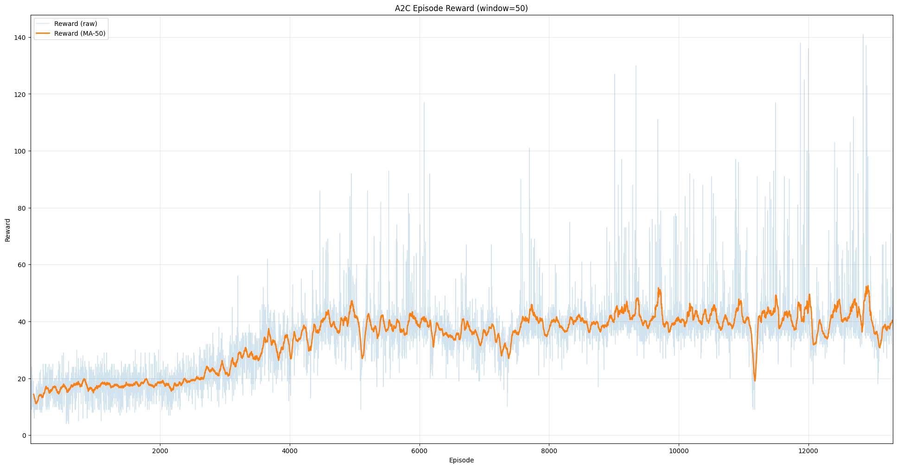
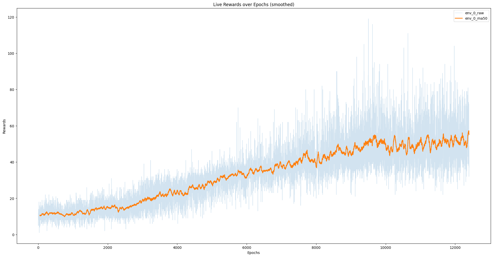

# Playing Atari 2600 with Reinforcement Learning

This project reproduces and compares two classic reinforcement learning algorithms:

- DQN (Deep Q-Network)
- A2C (Advantage Actor-Critic)

The experiments are conducted on Atari `Assault`, including training, visualization, and policy playback.

## Project Structure

```text
.
念岸岸 readme.md
念岸岸 readme_en.md
念岸岸 requirements.txt
念岸岸 models/
岫   念岸岸 dqn/                  # DQN checkpoints
岫   弩岸岸 a2c/                  # A2C checkpoints
念岸岸 scripts/
岫   念岸岸 train_DQN.ipynb       # Train DQN
岫   念岸岸 train_A2C.ipynb       # Train A2C
岫   念岸岸 play_DQN.ipynb        # Play with trained DQN
岫   弩岸岸 play_A2C.ipynb        # Play with trained A2C
念岸岸 report/
岫   念岸岸 main.pdf
岫   弩岸岸 images/
岫       念岸岸 reward_dqn.png
岫       弩岸岸 reward_a2c.png
念岸岸 resource/
岫   念岸岸 DQN.pdf
岫   弩岸岸 A3C.pdf
弩岸岸 task_description.pdf
```

## Environment Setup

Using a virtual environment is recommended.

### 1) Create and activate a virtual environment

Windows PowerShell:

```powershell
python -m venv deeplearning
Set-ExecutionPolicy -Scope Process -ExecutionPolicy RemoteSigned
.\deeplearning\Scripts\Activate.ps1
```

Linux/macOS:

```bash
python -m venv .venv
source .venv/bin/activate
```

### 2) Install dependencies

Install PyTorch first (CUDA 12.8 example; check the official site for your platform):

```powershell
pip install torch torchvision torchaudio --index-url https://download.pytorch.org/whl/cu128
```

Then install the remaining dependencies:

```powershell
pip install -r requirements.txt
```

## Quick Start

Launch Jupyter Notebook from the project root:

```powershell
jupyter notebook
```

Recommended execution order:

1. `scripts/train_DQN.ipynb`
2. `scripts/train_A2C.ipynb`
3. `scripts/play_DQN.ipynb`
4. `scripts/play_A2C.ipynb`

## Checkpoint Paths

- DQN training saves to: `models/dqn`
- A2C training saves to: `models/a2c`
- DQN playback loads: `models/dqn/timesteps_10000000.pt`
- A2C playback automatically loads the latest `timesteps_*.pt` from `models/a2c`

## Implementation Summary

### DQN

- CNN-based Q-network
- Replay Buffer
- Target Network synchronization
- Epsilon-greedy exploration
- Periodic checkpoint saving

### A2C

- Shared CNN backbone + Actor/Critic heads
- Parallel environment sampling (`num_envs=16`)
- n-step return (`n_steps=5`)
- Advantage normalization
- Entropy regularization + gradient clipping

## Results (Brief)

- A2C improves faster in early training due to higher sampling throughput.
- DQN reaches higher average reward in later stages with replay and target-network stability.

### A2C Reward Curve



### DQN Reward Curve



For full analysis, see `report/main.pdf`.

## Troubleshooting

1. Checkpoint not found

- Make sure training has finished and checkpoint files are generated.
- Verify folders: `models/dqn` and `models/a2c`.

2. Notebook kernel is not detected

- Ensure `ipykernel` is installed.
- Register/select the correct kernel in your environment.

3. OpenCV window does not show

- In remote/no-GUI environments, OpenCV pop-up windows may not work.
- Use saved videos in `play_demonstration/` instead.

4. References do not appear in report

- Compile report in this order: `xelatex -> biber -> xelatex -> xelatex`.

## References

- Mnih et al., *Playing Atari with Deep Reinforcement Learning*, 2013.
- Mnih et al., *Asynchronous Methods for Deep Reinforcement Learning*, 2016.
